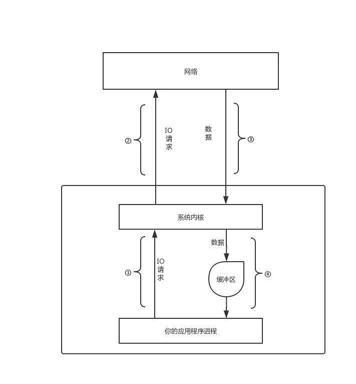

## IO模型
> 从IO请求可以分为`同步`和`异步`   
> 从数据读取(拷贝)可分为`阻塞`和`非阻塞`  
 
 ## 概念
对于一个读操作来说，一般会经过下面两个过程：  
1. 等待数据就绪．比如说，对于一个网络连接来说，就是等待数据通过连接到达主机．当数据到达主机时，把数据拷贝到内核中的缓冲区．
2. 将数据从内核拷贝到进程．即把数据从内核的缓冲区拷贝到应用程序的缓冲区．    

下图是一个标准的IO读操作


> 注：这里的读操作指的是IO读操作,java网络编程中的accept实质上也进行了IO读操作

当我们调用api通过socket进行读操作时，实际上是在进行操作④
实际上，当我们进行操作④时并不一定能读取到数据，因为系统内核可能还没有把数据写入缓冲区
这时候操作④有两种方案  
1. 阻塞：在缓冲区有数据之前应用程序一直等待，直到缓冲区有数据时程序再往下运行
2. 非阻塞：不管缓冲区有没有数据，应用程序都往下运行，一般通过while(true)反复读缓冲区

当我们需要进行读操作时，先要对系统内核发出IO请求(调用api)即操作①，当我们向内核请求读IO后并不一定能立即获得IO（你可以理解为程序在请求操作系统的一种资源，你需要排队获取资源的使用权）
但是你可能会有一些读取数据之后的后继操作，这时你会有两种方案  
1. 同步：排队直到IO操作结束再做后继操作    
2. 异步：先处理后继操作,当获得IO时进行IO操作  
问题来了程序怎么知道什么时候获得了IO

## 异步的解决方案
1. 通过一个线程不断查询IO是否就绪（轮询）  
2. 操作系统告诉程序（事件驱动）  

我们排列组合一下可以得到四种IO模型  
1. 同步阻塞
2. 同步非阻塞
3. 异步阻塞
4. 异步非阻塞  


## 同步阻塞  
首先声明一点，同步阻塞模型是无法实现服务端与多客户端通信的。
为什么呢？
前面说了，同步即等待IO操作执行完毕，然而你的IO操作是阻塞的，所以，这意味着，当你的IO操作不管是否需要等待，你的线程都是挂起的，这意味着你只能处理一个客户端的IO请求。
可以看一下服务端的代码

``` java
package com.io.demo.syncblock;

import java.io.*;
import java.net.ServerSocket;
import java.net.Socket;

/*
同步阻塞IO
 */
public class Server {

    private static final int PORT = 8888;

    public static void doSomething() {
        System.out.println("这里是后继操作");
    }

    public static void main(String[] args) throws IOException {
        ServerSocket serverSocket = new ServerSocket(PORT);
        while (true) {
            // 这里连接是阻塞的，accept实质上也进行了IO操作，三次握手的本质是传输是TCP数据包
            Socket client = serverSocket.accept();
            BufferedReader reader = new BufferedReader(new InputStreamReader(client.getInputStream()));
            while (!client.isClosed()) {
                String str;
                try {
                    // 这里读操作是阻塞的
                    if ((str = reader.readLine()) != null) {
                        System.out.println("\33 you received a messge:" + str);
                    }
                    doSomething(); // 后继操作
                } catch (IOException e) {
                    e.printStackTrace();
                }
            }
        }
    }
}

```


## 同步非阻塞（NIO实现）
> 

